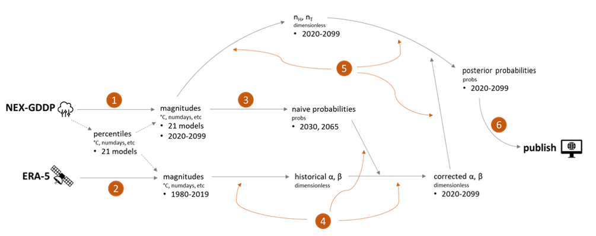

# Data Portal for Cities adaptation pilot
These Jupyter notebooks make up an analytical workflow for calculating maximum a priori probabilities of climate hazards by magnitude and year, stored as global raster images.
They use [ERA5](https://developers.google.com/earth-engine/datasets/catalog/ECMWF_ERA5_DAILY) historical climate observations and [NEX-GDDP](https://developers.google.com/earth-engine/datasets/catalog/NASA_NEX-GDDP) simulation data as inputs, and the workflow is suitable for any climate hazard that can be calculated from these datasets. Generally this includes precipitation and temperature hazards.

Many of the calculations require asynchronous processing by [Google Earth Engine](https://earthengine.google.com/), with intermediate results being stored in a GEE drive. Therefore, to use this workflow you must have your own GEE credentials.

The workbooks are numbered to correspond to this diagram:

Send inquiries regarding notebooks, images, and other items in this repo to ted.wong@wri.org.

Every item in this repository is a work in progress and should not be considered official WRI products or releases. For more information about the project status, please contact Eric.Mackres@wri.org.
